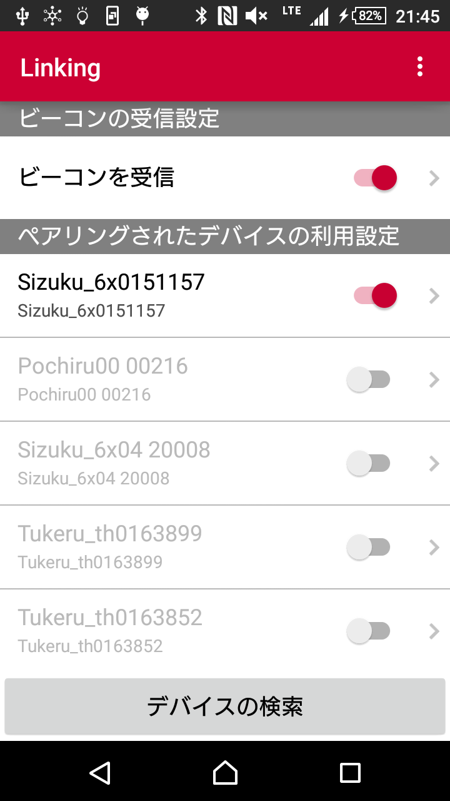
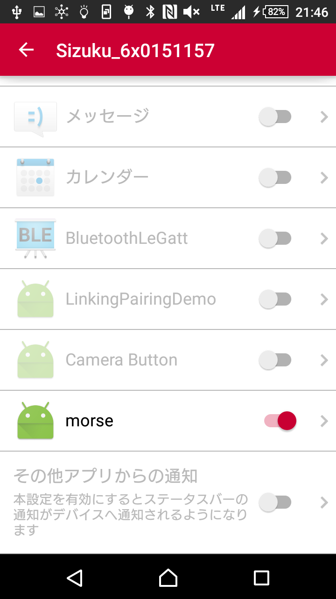

# Morse信号で言葉を伝える

 
[Project Linking](https://linkingiot.com/)対応デバイスの[Sizuku 6X](https://ssl.braveridge.com/store/html/products/detail.php?product_id=33)
でMorse信号を光らせるアプリです。

# 準備

まず、Morseのアプリをインストールします。
[Linkingアプリ](https://play.google.com/store/apps/details?id=com.nttdocomo.android.smartdeviceagent)で[Sizuku 6X](https://ssl.braveridge.com/store/html/products/detail.php?product_id=33)と連携しておきます。  
 

[Linkingアプリ](https://play.google.com/store/apps/details?id=com.nttdocomo.android.smartdeviceagent)のアプリ連携でMorseをONにします。  
 

開発者モードをON、デバッグをONにして、端末とUSB接続します。
